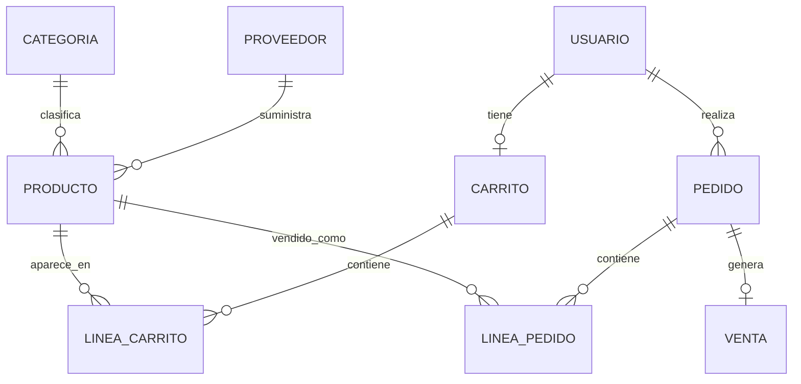

# CyberVoid S.L.

CyberVoid S.L. es una aplicacion web de tienda online desarrollada con Java, Spring Boot, Spring MVC, Spring Data JPA, MySQL, Thymeleaf, Spring Security y Maven.

El proyecto parte de un frontend estatico de moda alternativa/cyberpunk y lo integra en una aplicacion con backend real: usuarios, autenticacion, productos persistidos, clientes, proveedores, carrito en servidor, pedidos, ventas e informes.

## Tecnologias

- Java 17
- Spring Boot 3.3.5
- Spring MVC
- Spring Data JPA
- Spring Security
- Thymeleaf
- MySQL
- Maven
- H2 para pruebas
- Bootstrap y recursos estaticos del frontend existente

## Estructura general

```text
Proyecto_CyberVoid/
├── pom.xml
├── README.md
├── INFORME_PRUEBAS.md
├── docs/
│   └── estructura-proyecto-backend.md
├── src/
│   ├── main/
│   │   ├── java/com/cybervoid/
│   │   │   ├── CyberVoidApplication.java
│   │   │   ├── controller/
│   │   │   ├── dto/
│   │   │   ├── model/
│   │   │   ├── repository/
│   │   │   ├── security/
│   │   │   └── service/
│   │   └── resources/
│   │       ├── application.properties
│   │       ├── schema.sql
│   │       ├── static/
│   │       └── templates/
│   └── test/
│       ├── java/com/cybervoid/
│       │   ├── controller/
│       │   ├── repository/
│       │   ├── security/
│       │   ├── service/
│       │   └── CyberVoidApplicationTests.java
│       └── resources/application-test.properties
└── target/
```

Los HTML originales siguen en la raiz como referencia del prototipo inicial. La aplicacion Spring Boot usa las plantillas de `src/main/resources/templates` y los recursos de `src/main/resources/static`.

## Arquitectura

La aplicacion usa una arquitectura MVC por capas:

```text
Navegador
  ↓
Controladores Spring MVC
  ↓
Servicios de negocio
  ↓
Repositorios Spring Data JPA
  ↓
Entidades JPA
  ↓
MySQL
```

Responsabilidad de cada capa:

- `controller`: recibe peticiones HTTP, prepara el `Model` y devuelve vistas Thymeleaf.
- `service`: contiene la logica de negocio: registro, catalogo, carrito, pedidos, ventas e informes.
- `repository`: encapsula el acceso a base de datos mediante `JpaRepository`.
- `model`: define las entidades JPA que representan las tablas.
- `security`: configura autenticacion, autorizacion, login, logout y carga de usuarios.
- `dto`: contiene objetos de formulario que no son entidades de base de datos.
- `templates`: vistas Thymeleaf renderizadas por el servidor.
- `static`: CSS, JavaScript e imagenes.

## Arranque de la aplicacion

La clase principal es:

```text
src/main/java/com/cybervoid/CyberVoidApplication.java
```

`CyberVoidApplication` contiene el metodo `main` y la anotacion `@SpringBootApplication`. Desde ahi Spring Boot escanea los paquetes `controller`, `service`, `repository`, `model` y `security`, levanta Tomcat embebido y crea el contexto de la aplicacion.

## Modelo de dominio

Las clases del paquete `model` representan la informacion persistente del sistema.

### Usuario

Archivo: `src/main/java/com/cybervoid/model/Usuario.java`

Representa una cuenta real de la aplicacion. Se almacena en la tabla `usuarios`.

Campos principales:

- `id`: identificador.
- `nombre`: nombre del usuario.
- `email`: email unico usado para iniciar sesion.
- `password`: contrasena cifrada con BCrypt.
- `rol`: rol de seguridad (`ROLE_USER` o `ROLE_ADMIN`).
- `telefono`, `direccion`: datos de contacto.
- `activo`: permite habilitar o deshabilitar la cuenta.
- `creadoEn`: fecha de alta.

Se usa en:

- `UsuarioService`, para registro y busqueda.
- `CustomUserDetailsService`, para login.
- `Carrito`, como propietario del carrito.
- `Pedido`, como propietario de los pedidos.

### Role

Archivo: `src/main/java/com/cybervoid/model/Role.java`

Enum que define los roles de seguridad:

- `ROLE_USER`: usuario normal.
- `ROLE_ADMIN`: administrador.

Lo usa `Usuario` y tambien `SecurityConfig` al proteger rutas.

### Cliente

Archivo: `src/main/java/com/cybervoid/model/Cliente.java`

Representa clientes gestionables desde administracion. Se almacena en `clientes`.

Campos:

- `id`
- `nombre`
- `email`
- `telefono`
- `direccion`

Se lista en el panel `/admin` mediante `ClienteRepository`.

### Proveedor

Archivo: `src/main/java/com/cybervoid/model/Proveedor.java`

Representa proveedores de productos o dropshipping. Se almacena en `proveedores`.

Campos:

- `id`
- `nombre`
- `email`
- `telefono`
- `direccion`

Relacion:

- Un `Proveedor` puede estar asociado a muchos `Producto`.
- En `Producto` la relacion se modela con `@ManyToOne`.

### Categoria

Archivo: `src/main/java/com/cybervoid/model/Categoria.java`

Agrupa productos por genero, temporada, oferta o tipo de prenda. Se almacena en `categorias`.

Campos:

- `id`
- `nombre`
- `slug`: texto usado para rutas y busquedas, por ejemplo `mujer`, `hombre`, `ofertas`.
- `tipo`: valor del enum `CategoriaTipo`.

Relacion:

- Una `Categoria` puede tener muchos `Producto`.
- Cada `Producto` apunta a una categoria con `@ManyToOne`.

### CategoriaTipo

Archivo: `src/main/java/com/cybervoid/model/CategoriaTipo.java`

Enum que clasifica categorias:

- `GENERO`
- `PRENDA`
- `TEMPORADA`
- `OFERTA`

### Producto

Archivo: `src/main/java/com/cybervoid/model/Producto.java`

Representa cada articulo del catalogo. Se almacena en `productos`.

Campos:

- `id`
- `sku`: codigo unico.
- `nombre`
- `descripcion`
- `talla`
- `color`
- `precio`
- `precioAnterior`: se usa para ofertas.
- `stock`
- `imagenUrl`
- `activo`
- `proveedor`
- `categoria`

Relaciones:

- `Producto` tiene un `Proveedor` con `@ManyToOne`.
- `Producto` tiene una `Categoria` con `@ManyToOne`.
- `LineaCarrito` referencia un `Producto`.
- `LineaPedido` referencia un `Producto`.

Se usa en:

- Catalogo publico.
- Panel de administracion.
- Carrito.
- Confirmacion de pedidos.
- Control de stock.

### Carrito

Archivo: `src/main/java/com/cybervoid/model/Carrito.java`

Representa el carrito persistente de un usuario autenticado. Se almacena en `carritos`.

Campos:

- `id`
- `usuario`
- `lineas`
- `actualizadoEn`

Relaciones:

- `Carrito` tiene un `Usuario` con `@OneToOne`.
- `Carrito` tiene muchas `LineaCarrito` con `@OneToMany`.
- Usa `cascade = CascadeType.ALL` y `orphanRemoval = true` para guardar o eliminar lineas junto con el carrito.

Metodo relevante:

- `getTotal()`: suma los subtotales de sus lineas.

### LineaCarrito

Archivo: `src/main/java/com/cybervoid/model/LineaCarrito.java`

Representa un producto dentro del carrito. Se almacena en `lineas_carrito`.

Campos:

- `id`
- `carrito`
- `producto`
- `cantidad`

Relaciones:

- Muchas `LineaCarrito` pertenecen a un `Carrito` con `@ManyToOne`.
- Cada `LineaCarrito` apunta a un `Producto` con `@ManyToOne`.

Metodo relevante:

- `getSubtotal()`: calcula `producto.precio * cantidad`.

### Pedido

Archivo: `src/main/java/com/cybervoid/model/Pedido.java`

Representa una compra confirmada. Se almacena en `pedidos`.

Campos:

- `id`
- `codigo`: identificador visible, por ejemplo `CV-...`.
- `usuario`
- `fecha`
- `estado`
- `total`
- `direccionEnvio`
- `lineas`

Relaciones:

- Muchos `Pedido` pertenecen a un `Usuario` con `@ManyToOne`.
- Un `Pedido` tiene muchas `LineaPedido` con `@OneToMany`.
- Una `Venta` apunta a un `Pedido` con `@OneToOne`.

### PedidoEstado

Archivo: `src/main/java/com/cybervoid/model/PedidoEstado.java`

Enum con los estados posibles:

- `PENDIENTE`
- `PAGADO`
- `EN_PREPARACION`
- `ENVIADO`
- `CANCELADO`

### LineaPedido

Archivo: `src/main/java/com/cybervoid/model/LineaPedido.java`

Representa una linea historica dentro de un pedido. Se almacena en `lineas_pedido`.

Campos:

- `id`
- `pedido`
- `producto`
- `nombreProducto`
- `precioUnitario`
- `cantidad`
- `subtotal`

Relaciones:

- Muchas `LineaPedido` pertenecen a un `Pedido` con `@ManyToOne`.
- Cada `LineaPedido` referencia un `Producto` con `@ManyToOne`.

Guarda tambien `nombreProducto` y `precioUnitario` para conservar el historico aunque el producto cambie despues.

### Venta

Archivo: `src/main/java/com/cybervoid/model/Venta.java`

Representa el registro comercial de un pedido pagado. Se almacena en `ventas`.

Campos:

- `id`
- `pedido`
- `fecha`
- `total`
- `metodoPago`

Relacion:

- `Venta` tiene un `Pedido` con `@OneToOne`.

Se crea en `CarritoService.confirmarPedido`.

### Informe

Archivo: `src/main/java/com/cybervoid/model/Informe.java`

Representa informes generados por administracion. Se almacena en `informes`.

Campos:

- `id`
- `titulo`
- `tipo`
- `generadoEn`
- `contenido`

Se crea desde `InformeService.generarResumenOperativo`.

## Diagrama de relaciones entre entidades



## Repositorios

Los repositorios extienden `JpaRepository` y permiten consultar o guardar entidades sin escribir SQL manual para las operaciones habituales.

### UsuarioRepository

Archivo: `src/main/java/com/cybervoid/repository/UsuarioRepository.java`

Gestiona `Usuario`.

Metodos:

- `findByEmail(String email)`: busca por email para login y perfil.
- `existsByEmail(String email)`: comprueba duplicados en registro.

Lo usan:

- `UsuarioService`
- `CustomUserDetailsService`
- `DataInitializer`

### ClienteRepository

Archivo: `src/main/java/com/cybervoid/repository/ClienteRepository.java`

Gestiona `Cliente`.

Lo usan:

- `AdminController`
- `DataInitializer`

### ProveedorRepository

Archivo: `src/main/java/com/cybervoid/repository/ProveedorRepository.java`

Gestiona `Proveedor`.

Metodo:

- `findByNombre(String nombre)`: evita duplicar el proveedor inicial.

Lo usan:

- `AdminController`
- `DataInitializer`

### CategoriaRepository

Archivo: `src/main/java/com/cybervoid/repository/CategoriaRepository.java`

Gestiona `Categoria`.

Metodos:

- `findBySlug(String slug)`: localiza categorias por ruta.
- `findByTipo(CategoriaTipo tipo)`: permite filtrar por tipo.

Lo usan:

- `AdminController`
- `DataInitializer`

### ProductoRepository

Archivo: `src/main/java/com/cybervoid/repository/ProductoRepository.java`

Gestiona `Producto`.

Metodos:

- `findByActivoTrueOrderByNombreAsc()`: catalogo activo.
- `findByActivoTrueAndCategoriaSlugOrderByNombreAsc(String slug)`: productos por categoria.
- `findByActivoTrueAndPrecioAnteriorIsNotNullOrderByNombreAsc()`: ofertas.
- `findBySku(String sku)`: evita duplicar productos iniciales.

Lo usan:

- `ProductoService`
- `CarritoService`
- `AdminController`
- `InformeService`
- `DataInitializer`

### CarritoRepository

Archivo: `src/main/java/com/cybervoid/repository/CarritoRepository.java`

Gestiona `Carrito`.

Metodo:

- `findByUsuario(Usuario usuario)`: recupera el carrito persistente de un usuario.

Incluye `@EntityGraph(attributePaths = {"lineas", "lineas.producto"})` para cargar lineas y productos junto con el carrito.

Lo usa:

- `CarritoService`

### PedidoRepository

Archivo: `src/main/java/com/cybervoid/repository/PedidoRepository.java`

Gestiona `Pedido`.

Metodos:

- `findByUsuarioOrderByFechaDesc(Usuario usuario)`: historial de pedidos de un usuario.
- `findTop10ByOrderByFechaDesc()`: ultimos pedidos del panel de administracion.

Lo usan:

- `UsuarioController`
- `AdminController`
- `CarritoService`
- `InformeService`

### VentaRepository

Archivo: `src/main/java/com/cybervoid/repository/VentaRepository.java`

Gestiona `Venta`.

Lo usa:

- `CarritoService`, para registrar venta despues de confirmar pedido.

### InformeRepository

Archivo: `src/main/java/com/cybervoid/repository/InformeRepository.java`

Gestiona `Informe`.

Lo usan:

- `InformeService`
- `AdminController`

## Servicios

Los servicios contienen la logica de negocio y coordinan repositorios.

### UsuarioService

Archivo: `src/main/java/com/cybervoid/service/UsuarioService.java`

Responsabilidades:

- Buscar usuarios por email.
- Registrar usuarios nuevos.
- Comprobar si el email ya existe.
- Cifrar contrasenas con `PasswordEncoder`.
- Asignar por defecto el rol `ROLE_USER`.

Depende de:

- `UsuarioRepository`
- `PasswordEncoder`

Lo usan:

- `AuthController`
- `UsuarioController`
- `CarritoController`

### ProductoService

Archivo: `src/main/java/com/cybervoid/service/ProductoService.java`

Responsabilidades:

- Listar productos activos.
- Listar productos por categoria.
- Listar productos en oferta.
- Buscar producto por id.

Depende de:

- `ProductoRepository`

Lo usan:

- `HomeController`
- `ProductoController`

### CarritoService

Archivo: `src/main/java/com/cybervoid/service/CarritoService.java`

Responsabilidades:

- Obtener o crear el carrito de un usuario.
- Anadir productos al carrito.
- Validar stock antes de anadir.
- Actualizar cantidades.
- Eliminar lineas.
- Confirmar pedido.
- Crear lineas de pedido.
- Descontar stock.
- Crear una venta.
- Vaciar el carrito tras confirmar.

Depende de:

- `CarritoRepository`
- `ProductoRepository`
- `PedidoRepository`
- `VentaRepository`

Lo usa:

- `CarritoController`

Flujo interno al confirmar pedido:

```text
Usuario
  ↓
CarritoService.confirmarPedido()
  ↓
Carrito + LineaCarrito
  ↓
Validacion de stock
  ↓
Pedido + LineaPedido
  ↓
Venta
  ↓
Actualizacion de stock
  ↓
Carrito vacio
```

### InformeService

Archivo: `src/main/java/com/cybervoid/service/InformeService.java`

Responsabilidades:

- Generar informe operativo.
- Contar pedidos.
- Contar productos activos.
- Persistir el resultado como `Informe`.

Depende de:

- `InformeRepository`
- `PedidoRepository`
- `ProductoRepository`

Lo usa:

- `AdminController`

### DataInitializer

Archivo: `src/main/java/com/cybervoid/service/DataInitializer.java`

Implementa `CommandLineRunner`, por lo que se ejecuta al arrancar la aplicacion.

Responsabilidades:

- Crear usuarios iniciales.
- Crear cliente inicial.
- Crear proveedor inicial.
- Crear categorias.
- Crear productos del catalogo.

Datos iniciales:

- Admin: `admin@cybervoid.local` / `admin123`
- Usuario: `alex.void@example.com` / `user123`

Depende de:

- `UsuarioRepository`
- `ClienteRepository`
- `ProveedorRepository`
- `CategoriaRepository`
- `ProductoRepository`
- `PasswordEncoder`

## Controladores

Los controladores reciben peticiones HTTP y devuelven plantillas Thymeleaf.

### HomeController

Archivo: `src/main/java/com/cybervoid/controller/HomeController.java`

Ruta:

- `GET /`

Funcion:

- Carga ofertas mediante `ProductoService`.
- Devuelve la plantilla `index`.

### ProductoController

Archivo: `src/main/java/com/cybervoid/controller/ProductoController.java`

Rutas:

- `GET /mujer`
- `GET /hombre`
- `GET /ofertas`
- `GET /temporada/{slug}`

Funcion:

- Carga productos por categoria u oferta.
- Anade `titulo`, `descripcion` y `productos` al modelo.
- Devuelve `productos/catalogo`.

Depende de:

- `ProductoService`

### AuthController

Archivo: `src/main/java/com/cybervoid/controller/AuthController.java`

Rutas:

- `GET /login`
- `GET /registro`
- `POST /registro`

Funcion:

- Muestra formulario de login.
- Muestra formulario de registro.
- Valida `RegistroForm`.
- Llama a `UsuarioService.registrar`.
- Redirige a login si el registro es correcto.

Depende de:

- `UsuarioService`

### CarritoController

Archivo: `src/main/java/com/cybervoid/controller/CarritoController.java`

Ruta base:

- `/carrito`

Rutas:

- `GET /carrito`
- `POST /carrito/anadir/{productoId}`
- `POST /carrito/linea/{lineaId}`
- `POST /carrito/eliminar/{lineaId}`
- `POST /carrito/confirmar`

Funcion:

- Recupera el usuario autenticado desde `Principal`.
- Usa `UsuarioService` para cargar la entidad `Usuario`.
- Usa `CarritoService` para operar sobre el carrito.
- Devuelve la vista `carrito` o redirige tras operaciones.

Depende de:

- `CarritoService`
- `UsuarioService`

### UsuarioController

Archivo: `src/main/java/com/cybervoid/controller/UsuarioController.java`

Ruta:

- `GET /usuario`

Funcion:

- Carga los datos del usuario autenticado.
- Carga su historial de pedidos.
- Devuelve la vista `usuario`.

Depende de:

- `UsuarioService`
- `PedidoRepository`

### AdminController

Archivo: `src/main/java/com/cybervoid/controller/AdminController.java`

Ruta base:

- `/admin`

Rutas:

- `GET /admin`
- `GET /admin/productos/nuevo`
- `POST /admin/productos`
- `POST /admin/informes/generar`

Funcion:

- Muestra dashboard con productos, clientes, proveedores, pedidos e informes.
- Permite crear nuevos productos.
- Permite generar informes.

Depende de:

- `ProductoRepository`
- `CategoriaRepository`
- `ProveedorRepository`
- `ClienteRepository`
- `PedidoRepository`
- `InformeRepository`
- `InformeService`

Acceso:

- Solo usuarios con `ROLE_ADMIN`.

## Seguridad

### SecurityConfig

Archivo: `src/main/java/com/cybervoid/security/SecurityConfig.java`

Configura:

- Rutas publicas.
- Rutas autenticadas.
- Rutas de administracion.
- Formulario de login.
- Logout.
- `PasswordEncoder` con BCrypt.

Reglas principales:

```text
Publicas:
/, /mujer, /hombre, /ofertas, /temporada/**, /css/**, /js/**, /img/**, /assets/**, /login, /registro

Autenticadas:
/carrito/**, /usuario/**, /pedido/**

Administrador:
/admin/**
```

### CustomUserDetailsService

Archivo: `src/main/java/com/cybervoid/security/CustomUserDetailsService.java`

Implementa `UserDetailsService`.

Funcion:

- Spring Security llama a `loadUserByUsername`.
- Se busca el usuario en `UsuarioRepository.findByEmail`.
- Se devuelve un `UserDetails` con email, password cifrada, rol y estado activo.

Esto conecta la autenticacion de Spring Security con los usuarios reales de MySQL.

## DTO

### RegistroForm

Archivo: `src/main/java/com/cybervoid/dto/RegistroForm.java`

Objeto usado por el formulario de registro.

Campos:

- `nombre`
- `email`
- `password`
- `telefono`
- `direccion`

Validaciones:

- `@NotBlank` en nombre y email.
- `@Email` en email.
- `@Size(min = 6)` en password.

Se usa en:

- `AuthController`
- `UsuarioService`

## Vistas Thymeleaf

Las vistas estan en `src/main/resources/templates`.

### Plantillas principales

- `index.html`: pagina de inicio.
- `productos/catalogo.html`: catalogo reutilizable para mujer, hombre, ofertas y temporadas.
- `carrito.html`: carrito persistente del usuario.
- `usuario.html`: perfil e historial de pedidos.
- `auth/login.html`: inicio de sesion.
- `auth/registro.html`: registro de usuario.
- `admin/dashboard.html`: panel de administracion.
- `admin/producto-form.html`: alta de producto.

### Fragmentos

- `fragments/layout.html`: cabecera, navegacion, alertas y footer.
- `fragments/product-card.html`: tarjeta reutilizable de producto.

Las vistas se conectan con los controladores mediante los nombres devueltos en cada metodo, por ejemplo:

```java
return "productos/catalogo";
```

Ese valor renderiza:

```text
src/main/resources/templates/productos/catalogo.html
```

## Recursos estaticos

Los recursos del frontend estan en `src/main/resources/static`.

```text
static/
├── css/styles.css
├── js/main.js
├── img/
└── assets/img/
```

Spring Boot sirve estos archivos directamente desde rutas como:

- `/css/styles.css`
- `/js/main.js`
- `/assets/img/product-camiseta.svg`

## Base de datos

La configuracion principal esta en:

```text
src/main/resources/application.properties
```

Valores por defecto:

```properties
spring.datasource.url=${MYSQL_URL:jdbc:mysql://localhost:3306/cybervoid?createDatabaseIfNotExist=true&useSSL=false&serverTimezone=Europe/Madrid&allowPublicKeyRetrieval=true}
spring.datasource.username=${MYSQL_USER:root}
spring.datasource.password=${MYSQL_PASSWORD:root}
spring.jpa.hibernate.ddl-auto=update
```

El modelo SQL esta documentado en:

```text
src/main/resources/schema.sql
```

Tablas:

- `usuarios`
- `clientes`
- `proveedores`
- `categorias`
- `productos`
- `carritos`
- `lineas_carrito`
- `pedidos`
- `lineas_pedido`
- `ventas`
- `informes`

## Flujo de catalogo

```text
GET /mujer
  ↓
ProductoController.mujer()
  ↓
ProductoService.listarPorCategoria("mujer")
  ↓
ProductoRepository.findByActivoTrueAndCategoriaSlugOrderByNombreAsc("mujer")
  ↓
MySQL
  ↓
templates/productos/catalogo.html
```

## Flujo de registro y login

Registro:

```text
POST /registro
  ↓
AuthController.registrar()
  ↓
UsuarioService.registrar()
  ↓
PasswordEncoder.encode()
  ↓
UsuarioRepository.save()
  ↓
MySQL
```

Login:

```text
POST /login
  ↓
Spring Security
  ↓
CustomUserDetailsService.loadUserByUsername()
  ↓
UsuarioRepository.findByEmail()
  ↓
BCrypt verifica la contrasena
  ↓
Sesion autenticada
```

## Flujo de carrito y pedido

```text
POST /carrito/anadir/{productoId}
  ↓
CarritoController.anadir()
  ↓
UsuarioService.buscarPorEmail()
  ↓
CarritoService.anadirProducto()
  ↓
CarritoRepository.findByUsuario()
  ↓
ProductoRepository.findById()
  ↓
LineaCarrito guardada en servidor
```

Confirmacion:

```text
POST /carrito/confirmar
  ↓
CarritoController.confirmar()
  ↓
CarritoService.confirmarPedido()
  ↓
Valida stock
  ↓
Crea Pedido
  ↓
Crea LineaPedido
  ↓
Descuenta stock de Producto
  ↓
Crea Venta
  ↓
Vacia Carrito
```

## Flujo de administracion

```text
GET /admin
  ↓
Spring Security valida ROLE_ADMIN
  ↓
AdminController.dashboard()
  ↓
Repositorios de productos, clientes, proveedores, pedidos e informes
  ↓
templates/admin/dashboard.html
```

Crear producto:

```text
POST /admin/productos
  ↓
AdminController.guardarProducto()
  ↓
ProductoRepository.save()
  ↓
MySQL
```

Generar informe:

```text
POST /admin/informes/generar
  ↓
AdminController.generarInforme()
  ↓
InformeService.generarResumenOperativo()
  ↓
InformeRepository.save()
```

## Rutas principales

| Ruta | Metodo | Acceso | Controlador | Uso |
|---|---:|---|---|---|
| `/` | GET | Publico | `HomeController` | Inicio |
| `/mujer` | GET | Publico | `ProductoController` | Catalogo mujer |
| `/hombre` | GET | Publico | `ProductoController` | Catalogo hombre |
| `/ofertas` | GET | Publico | `ProductoController` | Productos rebajados |
| `/temporada/{slug}` | GET | Publico | `ProductoController` | Coleccion de temporada |
| `/login` | GET/POST | Publico | `AuthController` / Spring Security | Inicio de sesion |
| `/registro` | GET/POST | Publico | `AuthController` | Registro |
| `/carrito` | GET | Usuario | `CarritoController` | Ver carrito |
| `/carrito/anadir/{productoId}` | POST | Usuario | `CarritoController` | Anadir producto |
| `/carrito/linea/{lineaId}` | POST | Usuario | `CarritoController` | Cambiar cantidad |
| `/carrito/eliminar/{lineaId}` | POST | Usuario | `CarritoController` | Eliminar linea |
| `/carrito/confirmar` | POST | Usuario | `CarritoController` | Confirmar pedido |
| `/usuario` | GET | Usuario | `UsuarioController` | Perfil e historial |
| `/admin` | GET | Admin | `AdminController` | Panel de administracion |
| `/admin/productos/nuevo` | GET | Admin | `AdminController` | Formulario producto |
| `/admin/productos` | POST | Admin | `AdminController` | Guardar producto |
| `/admin/informes/generar` | POST | Admin | `AdminController` | Generar informe |

## Configuracion de MySQL

Antes de ejecutar la aplicacion con MySQL, configura credenciales validas:

```powershell
$env:MYSQL_URL="jdbc:mysql://localhost:3306/cybervoid?createDatabaseIfNotExist=true&useSSL=false&serverTimezone=Europe/Madrid&allowPublicKeyRetrieval=true"
$env:MYSQL_USER="root"
$env:MYSQL_PASSWORD="tu_password"
```

Si el usuario de MySQL no coincide con `root/root`, la aplicacion no podra abrir conexion y fallara al arrancar.

## Ejecucion local

Desde la raiz del proyecto:

```powershell
mvn spring-boot:run
```

La aplicacion queda disponible en:

```text
http://localhost:8080
```

Credenciales iniciales:

```text
Administrador:
admin@cybervoid.local / admin123

Usuario:
alex.void@example.com / user123
```

## Pruebas

Las pruebas estan organizadas por paquete en:

```text
src/test/java/com/cybervoid/
```

El perfil de test usa H2 en modo MySQL:

```text
src/test/resources/application-test.properties
```

Ejecutar pruebas:

```powershell
mvn test
```

Suite actual:

- `CyberVoidApplicationTests`: prueba de integracion ligera del contexto Spring, paginas publicas y reglas principales de seguridad.
- `service/ProductoServiceTest`: catalogo activo, filtros por categoria/ofertas y busqueda por id.
- `service/UsuarioServiceTest`: registro, normalizacion de email, cifrado de password, rol por defecto y duplicados.
- `service/CarritoServiceTest`: creacion de carrito, anadir productos, actualizar cantidades, validacion de stock, confirmar pedido, crear venta y vaciar carrito.
- `service/InformeServiceTest`: generacion del resumen operativo.
- `security/CustomUserDetailsServiceTest`: carga de usuarios, autoridades y estado activo/inactivo para Spring Security.
- `controller/AuthControllerTest`: login, registro, validacion de formulario y gestion de email duplicado.
- `controller/ProductoControllerTest`: rutas de catalogo, ofertas y temporadas.
- `repository/ProductoRepositoryTest`: consultas derivadas de productos con `@DataJpaTest` y H2.

Resultado validado:

```text
Tests run: 41, Failures: 0, Errors: 0, Skipped: 0
BUILD SUCCESS
```

El detalle de trazabilidad entre objetivos, requisitos funcionales y pruebas esta documentado en:

```text
INFORME_PRUEBAS.md
```

Funcionalidades documentadas pero no implementadas de forma testeable actualmente:

- Variantes de producto como entidad o flujo propio.
- CRUD completo de clientes y proveedores.
- Actualizacion de estado de pedidos desde servicio/controlador.
- Generacion de ticket.
- Registro persistente de operaciones.
- Integracion externa real con proveedores/dropshipping.

## Empaquetado y despliegue

Crear el JAR:

```powershell
mvn clean package
```

Ejecutar el JAR:

```powershell
java -jar target/cybervoid-1.0.0.jar
```

Requisitos de despliegue:

- JDK 17 o superior.
- Maven 3.9 o superior para compilar.
- MySQL disponible.
- Usuario MySQL con permisos sobre la base de datos `cybervoid`.
- Variables `MYSQL_URL`, `MYSQL_USER` y `MYSQL_PASSWORD` configuradas.

## Relacion entre clases principales

Resumen de dependencias:

```text
HomeController
  -> ProductoService
    -> ProductoRepository
      -> Producto

ProductoController
  -> ProductoService
    -> ProductoRepository
      -> Producto, Categoria

AuthController
  -> UsuarioService
    -> UsuarioRepository
    -> PasswordEncoder
      -> Usuario

CustomUserDetailsService
  -> UsuarioRepository
    -> Usuario

CarritoController
  -> UsuarioService
  -> CarritoService
    -> CarritoRepository
    -> ProductoRepository
    -> PedidoRepository
    -> VentaRepository
      -> Carrito, LineaCarrito, Producto, Pedido, LineaPedido, Venta

UsuarioController
  -> UsuarioService
  -> PedidoRepository
    -> Usuario, Pedido

AdminController
  -> ProductoRepository
  -> CategoriaRepository
  -> ProveedorRepository
  -> ClienteRepository
  -> PedidoRepository
  -> InformeRepository
  -> InformeService
    -> Producto, Categoria, Proveedor, Cliente, Pedido, Informe

DataInitializer
  -> UsuarioRepository
  -> ClienteRepository
  -> ProveedorRepository
  -> CategoriaRepository
  -> ProductoRepository
  -> PasswordEncoder
```

## Estado del proyecto

El proyecto incluye:

- Proyecto Spring Boot real.
- `pom.xml` con dependencias.
- Codigo Java por capas.
- Controladores, servicios, repositorios y entidades.
- Suite de pruebas automatizadas con JUnit 5, Mockito, MockMvc, Spring Security Test y H2.
- Informe de trazabilidad de pruebas en `INFORME_PRUEBAS.md`.
- Conexion MySQL configurable.
- Script SQL y modelo de datos real.
- Autenticacion real con Spring Security.
- Persistencia en servidor.
- Gestion real de productos, clientes, proveedores, carritos, ventas, pedidos e informes.
